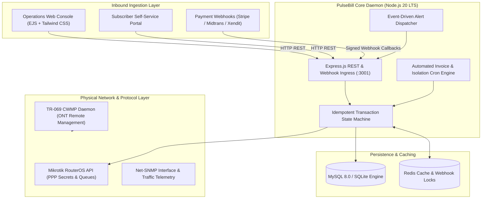
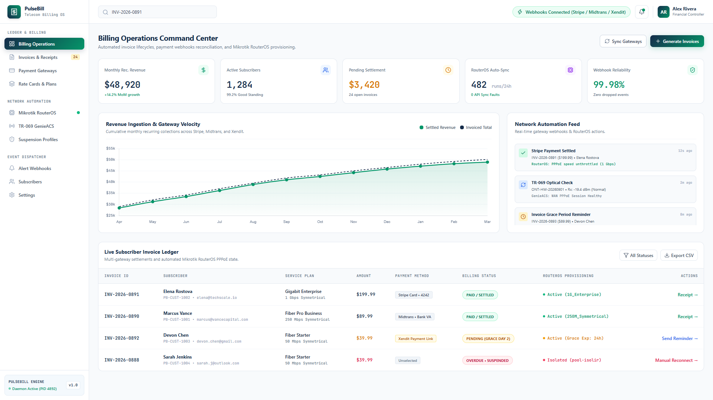

<div align="center">

# PulseBill
### Autonomous Telecom Billing Engine, Mikrotik RouterOS Automation & Multi-Gateway Payment Orchestrator

[](#)
[](LICENSE)
[](#)
[](#)
[](#)
[](https://stripe.com)

<p align="center">
  <b>An enterprise-grade financial transaction and network automation engine for modern Internet Service Providers (ISPs).</b><br/>
  Automates monthly recurring billing cycles, reconciles payment webhooks with strict idempotency, and provisions subscriber bandwidth directly on edge access routers via Mikrotik RouterOS API and TR-069 CWMP.
</p>

[Overview](#overview) • [System Architecture](#system-architecture) • [Visual Showcase](#visual-showcase) • [Key Capabilities](#key-capabilities) • [Technology Matrix](#technology-matrix) • [Quick Start](#quick-start) • [API & Webhook Reference](#api--webhook-reference)

---

</div>

## Overview

Modern Internet Service Providers face operational friction when billing records and access router configurations become out of sync. Manual reconciliation leads to revenue leakage, delayed service activations, and customer frustration.

**PulseBill** bridges the gap between financial ledgers and physical network routing:
1. **Autonomous Invoice Lifecycle:** Evaluates subscriber billing cycles on schedule, computes proration and recurring fees, and generates digital invoices with automated multi-channel notifications.
2. **Idempotent Webhook Settlement:** Ingests asynchronous payment callbacks from Stripe, Midtrans, and Xendit, guaranteeing exactly-once transaction processing and instant status updates.
3. **Automated RouterOS Provisioning:** Modifies PPPoE secrets, queue bandwidth limits, and firewall address lists on Mikrotik edge routers within seconds of payment verification.
4. **Automated Network Isolation & Grace Periods:** Safely places delinquent subscribers into non-routable walled-garden pools (`pool-isolir`) after grace period expiration, and automatically unthrottles access immediately upon settlement.

---

## System Architecture



---

## Visual Showcase

<div align="center">
  <h3>Billing Operations & Gateway Velocity Console</h3>
  
  <p><i>Real-time Monthly Recurring Revenue (MRR) tracking, automated gateway webhook reconciliation, live subscriber ledger, and direct Mikrotik RouterOS synchronization.</i></p>
</div>

---

## Key Capabilities

### Autonomous Monthly Billing & Invoicing Engine
- Automated cron-driven invoice generation on configured calendar days (e.g. 1st of each month).
- Support for recurring packages, symmetrical and asymmetrical bandwidth rate cards, and dynamic tax calculations.
- Configurable payment grace periods with automated scheduled notifications.

### Multi-Gateway Webhook Reconciliation
- Unified payment adapter supporting:
  - **Stripe:** Card payments and Checkout Sessions.
  - **Midtrans:** Virtual Accounts (BCA, Mandiri, BNI, BRI), QRIS, and e-Wallets.
  - **Xendit:** Invoice links, retail outlets, and direct debit.
- Idempotency key tracking in Redis to prevent duplicate ledger credits on webhook retries.

### Automated Mikrotik RouterOS Provisioning
- Directly interfaces with RouterOS v6/v7 via port 8728 API (`node-routeros`).
- Dynamically creates, edits, and disables PPPoE user secrets and queue profiles.
- Automated service suspension: Moves delinquent subscribers to isolated IP pools (`pool-isolir`) and redirects traffic to the payment portal.
- Automated service restoration: Unthrottles bandwidth profiles immediately upon payment settlement without requiring manual network admin intervention.

### Remote ONT Management via TR-069 (GenieACS)
- Real-time optical power (Rx/Tx dBm) diagnostics across customer ONTs.
- Remote reboot, firmware upgrades, and WAN interface provisioning over TR-069 CWMP.

---

## Technology Matrix

| Layer | Technologies Utilized | Purpose in PulseBill |
| :--- | :--- | :--- |
| **Runtime Environment** | Node.js 20 LTS (Alpine Linux) | High-concurrency event-driven application daemon |
| **HTTP Framework** | Express.js 4.x | REST API endpoints, customer portal, and webhook receivers |
| **Frontend Rendering** | EJS Templates, Tailwind CSS 4.x | Server-rendered high-density operational console |
| **Design System** | Meta Enterprise Design System | `Optimistic Text/Display`, `Meta System Sans`, and `JetBrains Mono` |
| **Network Protocols** | `node-routeros`, `net-snmp`, Axios | Mikrotik API, SNMP v2c telemetry, and TR-069 CWMP REST |
| **Payment SDKs** | `stripe`, `midtrans-client`, `xendit-node` | Multi-gateway transaction processing |
| **Persistence** | MySQL 8.0 / SQLite3 | Relational ledger, invoice items, and subscriber records |
| **Caching & Locking** | Redis 7 | Webhook idempotency keys and cron job distributed locks |
| **Job Scheduling** | `node-cron` | Periodic invoice generation and grace-period evaluation |
| **Containerization** | Docker, Docker Compose | Reproducible development and production orchestration |

---

## Quick Start

### Prerequisites
- Docker Engine & Docker Compose (Recommended)
- Or Node.js 20+ with MySQL / SQLite

### Option 1: Docker Compose (Instant Deployment)

```bash
# Clone the repository
git clone https://github.com/FeriHidayat95/pulsebill.git
cd pulsebill

# Configure environment
cp .env.example .env
cp settings.example.json settings.json

# Spin up services (PulseBill Core + MySQL + Redis)
docker compose up -d

# Verify service health
docker compose ps
```

The billing operations portal will be available at `http://localhost:3001`.

---

### Option 2: Local Development Setup

```bash
# Install dependencies
npm install

# Configure environment
cp .env.example .env
cp settings.example.json settings.json

# Seed demo subscribers, packages, and invoices
npm run seed

# Launch daemon in development mode
npm run dev
```

---

## Demo Credentials

| Role | Username / Identifier | Password | Access Level |
| :--- | :--- | :--- | :--- |
| **System Administrator** | `admin` | `change_me_immediately` | Full Billing & Network Gateway Control |
| **Subscriber Portal** | `PB-CUST-1001` | `(Account Portal PIN)` | Invoice View & Online Settlement |

---

## API & Webhook Reference

### Core Ingress Endpoints

| Method | Endpoint | Description |
| :--- | :--- | :--- |
| `GET` | `/health` | System liveness probe and database connectivity check |
| `GET` | `/api/invoices` | List invoices with customer and payment status filtering |
| `POST` | `/api/invoices/generate` | Trigger manual batch invoice generation for active accounts |
| `POST` | `/api/webhooks/stripe` | Ingest and verify signed Stripe payment event webhooks |
| `POST` | `/api/webhooks/midtrans` | Handle Midtrans payment notification and verify signature |
| `POST` | `/api/webhooks/xendit` | Ingest Xendit invoice settlement callback token |
| `POST` | `/api/network/routeros/sync` | Trigger reconciliation of PPPoE secrets with billing status |

### Example Webhook Ingestion Response

```json
{
  "status": "success",
  "event": "payment.settled",
  "invoice_number": "INV-2026-0891",
  "amount_received": 199.99,
  "currency": "USD",
  "gateway": "stripe",
  "actions_dispatched": [
    {
      "target": "mikrotik_routeros",
      "action": "unthrottle_pppoe_profile",
      "username": "elena_rostova",
      "assigned_profile": "1G_Enterprise",
      "status": "applied"
    },
    {
      "target": "notification_hub",
      "action": "send_receipt_receipt",
      "recipient": "elena.rostova@example.com",
      "status": "queued"
    }
  ],
  "timestamp": "2026-09-05T17:51:30Z"
}
```

---

## License

Distributed under the MIT License. See [LICENSE](LICENSE) for details.
